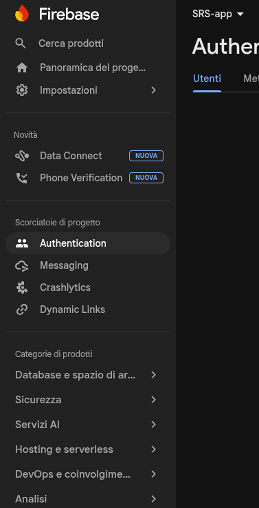

## Documentation:

- https://firebase.google.com/docs/cloud-messaging/send/v1-api?hl=it#authorize-http-v1-send-requests
- https://firebase.google.com/docs/cloud-messaging/send/admin-sdk?hl=it&_gl=1*10dfsn6*_up*MQ..*_ga*MTIyNDYyNjYyMC4xNzc1MjAwNjQy*_ga_CW55HF8NVT*czE3NzUyMDA2NDIkbzEkZzAkdDE3NzUyMDE0NDMkajYwJGwwJGgw

Go to the **firebase console**:
https://console.firebase.google.com/

Create/Select an existing project and manage it with the left panel

